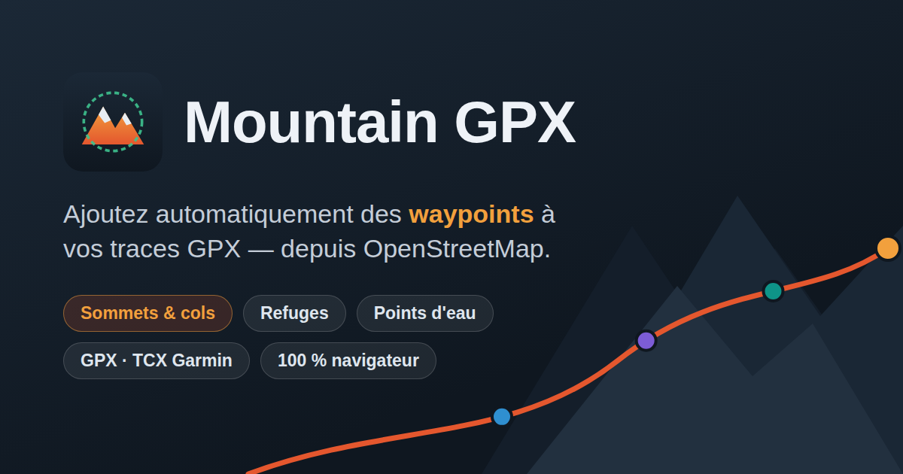

# Mountain GPX



Application web qui ajoute automatiquement des waypoints (sommets, cols,
refuges, points d'eau…) à une trace GPX, à partir des données OpenStreetMap.
100 % client-side : le fichier GPX est traité dans le navigateur, seules des
requêtes vers l'API Overpass sont émises.

Déployée sur https://krisanselmo.github.io/mountaingpx/

## English

Mountain GPX automatically adds waypoints (peaks, mountain passes, huts,
water points, lakes, waterfalls, viewpoints…) to a hiking, trail-running or
mountain-bike GPX track, using OpenStreetMap data (Overpass API). It snaps
each point of interest onto the route, draws an elevation profile and a
printable roadbook, and exports the enriched track as GPX or as a Garmin
TCX course with typed CoursePoints. Free, no sign-up, 100% client-side —
your file never leaves the browser — and installable as an offline-capable
PWA. Available in English, French, German, Spanish and Italian:
https://krisanselmo.github.io/mountaingpx/en.html

## Fonctionnalités

- Import GPX (`trk` et `rte`), FIT (activités et parcours Garmin, décodeur
  binaire maison), TCX (`Trackpoint` + `CoursePoint` typés) et KML
  (`LineString`, `gx:Track`, placemarks) par glisser-déposer ou sélecteur
  de fichier.
- Les waypoints (`wpt`) déjà présents dans le fichier — généré par Mountain
  GPX ou non — sont affichés sur la carte, le profil et le roadbook ; leur
  `type`/`sym` est rattaché au catalogue de POI, avec repli sur un type
  générique quand il n'est pas supporté, et le `type` d'origine est conservé
  à l'export.
- Récupération des POI via l'API Overpass : sommets, cols, refuges, fontaines,
  lacs, cascades, chapelles, points de vue, etc.
- Accrochage des POI sur la trace : distance de Haversine, point le plus
  proche, projection perpendiculaire sur le segment.
- Sélection par type de POI, « avec nom » et/ou « sans nom », requête Overpass
  personnalisée, distance d'accrochage réglable, inversion du sens de la trace.
- Carte Leaflet (OpenTopoMap / OpenStreetMap / satellite Esri, overlay
  sentiers, overlay points d'eau) avec popups des tags OSM ; renommage et
  suppression des waypoints depuis la carte (suppression annulable depuis
  le toast).
- Waypoints manuels : clic droit (appui long sur mobile) sur la carte pour
  ajouter un waypoint nommé et typé (ravitaillement, rendez-vous…), inclus
  dans le roadbook, le partage et les exports.
- Repères réguliers le long de la trace, configurables dans les options
  avancées : tous les N km ou tous les N m de D+ cumulé.
- Profil altimétrique et statistiques (distance, D+, altitude max) ; le
  survol du profil (souris ou doigt) suit la position sur la carte.
- Roadbook : liste des waypoints triés par kilométrage (icône, type, km,
  altitude), cliquables pour centrer la carte, imprimable (mise en page
  d'impression dédiée).
- Partage de la trace par URL ou QR code (au choix dans une modale) : la
  trace complète et ses waypoints (nom, type, position, altitude) sont
  encodés dans le lien (`#track=…` — deltas + varint + deflate + base64url),
  sans aucun serveur. Les traces trop longues sont simplifiées
  (Douglas-Peucker) juste assez pour tenir dans l'URL (~4000 caractères,
  ~2800 en QR code — la capacité maximale d'un QR code) ; les waypoints,
  eux, ne sont jamais simplifiés. La modale propose aussi l'envoi du fichier
  GPX complet — sans simplification — par le menu de partage de l'appareil
  (Web Share, mobile surtout), et l'envoi vers Garmin Connect (téléchargement
  du TCX + ouverture de la page d'import).
- Export GPX enrichi des waypoints, téléchargé localement ; les horodatages
  (`<time>`) du fichier source sont conservés (interpolés sur les points
  insérés par l'accrochage).
- Export TCX (parcours Garmin) : la trace enrichie et les waypoints typés
  (`CoursePoint` : sommet, eau, ravitaillement…) importables dans Garmin Connect.
- Préférences mémorisées dans `localStorage`.
- **PWA installable** : l'application peut être ajoutée à l'écran d'accueil
  (mobile) ou installée comme app de bureau, et fonctionne hors-ligne grâce à
  un service worker (mise en cache de l'app, des tuiles carto déjà consultées
  et des réponses Overpass).

## Développement

Build [Vite](https://vite.dev), Leaflet en dépendance npm.

```bash
npm install
npm run dev        # serveur de développement (http://localhost:5173)
npm test           # tests unitaires (node --test), exécutés aussi par la CI
npm run test:e2e   # tests end-to-end Playwright (Overpass simulé), aussi en CI
npm run build      # build de production dans dist/
npm run preview    # sert le build de production en local
```

Pour les tests end-to-end, `npx playwright install chromium` télécharge le
navigateur au premier lancement (ou pointez `PLAYWRIGHT_CHROMIUM_PATH` vers
un Chromium déjà installé).

`dist/` est un site statique à chemins relatifs (`base: './'`), déployable sur
n'importe quel hébergeur statique.

## Structure

```
├── index.html          # interface (SPA), point d'entrée Vite
├── public/             # assets copiés tels quels (favicon, icônes PWA)
├── css/style.css       # styles
├── e2e/                # tests end-to-end Playwright (Overpass simulé)
├── test/               # tests unitaires (node --test)
└── js/                 # modules ES
    ├── geometry.js     # Haversine, plus proche point, projection
    ├── poi.js          # catalogue POI, filtres Overpass, détection de type
    ├── icons.js        # icônes SVG inline (Lucide, licence ISC + glyphes maison), pins Leaflet
    ├── html.js         # échappement HTML partagé
    ├── gpx.js          # parsing et génération GPX (horodatages préservés)
    ├── formats.js      # parseurs d'import FIT, TCX et KML
    ├── milestones.js   # repères distance / D+ le long de la trace
    ├── tcx.js          # génération TCX (parcours Garmin)
    ├── share.js        # encodage compact de la trace pour le partage par URL
    ├── overpass.js     # requêtes Overpass segmentées et hedgées, accrochage
    ├── profile.js      # profil altimétrique SVG
    ├── roadbook.js     # lignes du roadbook (liste des waypoints au km)
    ├── water.js        # overlay « points d'eau » à la demande
    └── app.js          # carte Leaflet, UI, orchestration
```

## Déploiement

`.github/workflows/deploy-webapp.yml` : à chaque push sur `master`,
`npm ci && npm test && npm run build` puis publication de `dist/` à la
racine de la branche `gh-pages`, servie par GitHub Pages. Si les tests ou
le build échouent, rien n'est déployé.

`.github/workflows/pr-preview.yml` : chaque pull request est déployée en
préversion sous `pr-preview/pr-<n>/` de la branche `gh-pages`, et le lien de
test est posté automatiquement en commentaire de la PR. Nécessite que la
source GitHub Pages du dépôt soit « Deploy from a branch : gh-pages /(root) »
(Settings → Pages).

## Notes

- Les requêtes Overpass sont réparties sur plusieurs instances publiques :
  la trace est découpée en segments interrogés en parallèle, et chaque requête
  est relancée sur une autre instance après 8 s sans réponse.
- Les marqueurs sont des `L.divIcon` SVG générés par `js/icons.js` — aucun
  asset image.
- `scripts/build-lang-pages.mjs` génère au build une page d'entrée par
  langue (`en.html`, `de.html`…) avec les meta traduites, ainsi que
  `sitemap.xml` ; les préversions de PR sont marquées `noindex`
  (`NOINDEX_BUILD=1` dans `pr-preview.yml`).
- L'URL publique n'est écrite nulle part en dur : elle est résolue par
  `scripts/site-url.mjs` — variable d'environnement `SITE_URL`, sinon
  dérivée de `GITHUB_REPOSITORY` sur GitHub Actions (un fork déploie donc
  sur `https://<owner>.github.io/<repo>/` sans rien configurer), sinon le
  champ `homepage` de `package.json` (builds locaux).
